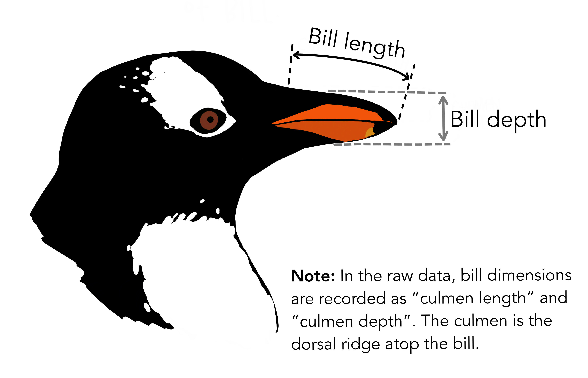

This exercise uses the Palmer Penguins dataset (`seaborn.load_dataset('penguins')`) and ties directly to the **M3-1: Statistical Analysis** learning outcomes. Work through the sections in order. Where you are asked for prose, use your own words in a short paragraph unless a bullet list is requested.

Dataset reference: [Palmer Penguins](https://allisonhorst.github.io/palmerpenguins/).

```python
import numpy as np
import pandas as pd
import seaborn as sns

df = sns.load_dataset("penguins")
df.head()
```

### Meet the Palmer penguins


### Bill dimensions

The culmen is the upper ridge of a bird’s bill. In the simplified `penguins` data, culmen length and depth are renamed as variables `bill_length_mm` and `bill_depth_mm` to be more intuitive.

For this penguin data, the culmen (bill) length and depth are measured as shown below (thanks Kristen Gorman for clarifying!):



---

## A. Concepts: what statistics is and how we use data

**1.** For this dataset, what is a reasonable **population** you might want to learn about? What is the **sample** you actually have in `df`? (One or two sentences each.)

**2.** List every column in `df`. For each, label it **numerical** or **categorical** (if a column could be debated, say why).

**3.** Give **two new examples** of variables that are clearly numerical and **two** that are clearly categorical *not* in this table (any domain you like).

---

## B. Calculations on the sample: proportion, mean, variance

Use the cleaned numeric columns only where needed (drop rows with missing body mass or bill length, or use `.dropna(subset=[...])` as you prefer). Show your code and round printed numbers sensibly.

**1.** For the variable `body_mass_g`:

- Compute the **proportion** of penguins with body mass **greater than** the overall median body mass (among non-missing values).
- Compute the **mean** and **variance** of `body_mass_g` (same subset).

```python
# YOUR CODE
```

**2.** For `body_mass_g`, identify at least **two** distributional summary measures that describe **center** and **spread** (name them and compute them). Optionally add a third that describes **shape** (e.g. skewness), if you know how to compute it.

```python
# YOUR CODE
```

---

## C. Shape of distributions: vocabulary and examples

**1.** Briefly define each shape in your own words: **normal (Gaussian)**, **uniform**, **skewed**, **exponential**.

**2.** Give **two real-world examples** of quantities that are *often modeled as* roughly normally distributed (they need not be perfect). (you can search the internet)

**3.** Give **one example** of data that is typically **not** normal—e.g. **exponential-like** or strongly skewed—and say why. (you can search the internet)

---

## D. Percentiles and the empirical rule (normal distribution)

Work on `body_mass_g` (non-missing) or `bill_length_mm`—pick one and stick to it for this section.

**1.** In plain language, explain what the **75th percentile** of body mass means for a penguin in this sample.

**2.** Compute the **25th, 50th, and 75th percentiles** for your chosen variable.

```python
# YOUR CODE
```

Assume for **discussion** that flipper length (or another chosen numeric column) were **exactly** normal with the mean and standard deviation you observe in the sample.

**3.** For a normal distribution, explain what share of values fall within **1**, **2**, and **3 standard deviations** of the mean (the empirical rule). Then **compute** the interval $\mu \pm 1\sigma$, $\mu \pm 2\sigma$, and $\mu \pm 3\sigma$ using your sample $\mu$ and $\sigma$ for that variable.

```python
# YOUR CODE
```

---

## E. Box plot: read the graphic

**1.** (SOLVED) Draw a **box plot** of `body_mass_g`, split by `species`.

```python
#| label: boxplot-body-mass-by-species
#| fig-cap: "Body mass (g) by penguin species"
import matplotlib.pyplot as plt
import seaborn as sns

df_box = sns.load_dataset("penguins").dropna(subset=["body_mass_g", "species"])

fig, ax = plt.subplots(figsize=(7, 4))
sns.boxplot(data=df_box, x="species", y="body_mass_g", hue='sex', ax=ax)
ax.set_title("Body mass by species")
ax.set_xlabel("Species")
ax.set_ylabel("Body mass (g)")
plt.tight_layout()
```

**2.** On your plot, **label or describe** what each part represents: median, quartiles, whiskers, and points outside the whiskers (if any). What does the box width tell you?

*(Your interpretation.)*

**3.** Write **two** sentences about the sample using words like **“most”** and **“few”** (e.g. which species tend to be heavier). Base this only on what you see in the plot.

*(Your interpretation.)*

**4.** Write **one** quantitative claim about the data (e.g. “the median body mass of Chinstrap is above 3500 g”). Then **verify** it with code (`groupby`, `median`, etc.) and state whether your claim was **true or false**.

*(Your claim and conclusion: write in prose.)*

Use the cell below as a starting point: it prints **medians by species** and shows one example check (Chinstrap median vs 3500 g). Adapt the last lines to match *your* claim.

```python
#| label: verify-median-example
import seaborn as sns

df_v = sns.load_dataset("penguins").dropna(subset=["body_mass_g", "species"])

medians = df_v.groupby("species", observed=True)["body_mass_g"].median()
print("Median body mass (g) by species:")
print(medians)

# Example verification — replace with checks that match your own claim
chin_median = medians.get("Chinstrap")
print("\nExample claim: Chinstrap median > 3500 g")
print("  Chinstrap median:", chin_median)
print("  Claim is true:", chin_median > 3500)
```

---

## F. Outliers

**1.** Name **two** methods for identifying or **removing outliers** on a numeric column. For each, give a **one-sentence** explanation of the rule. Then show **one** method applied in code to flag outliers in `bill_length_mm` (do not delete them from the full dataset the count or indices is enough).

```python
# YOUR CODE
```
